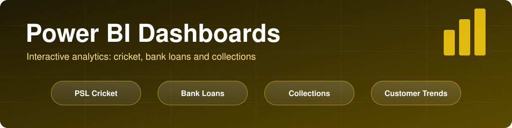
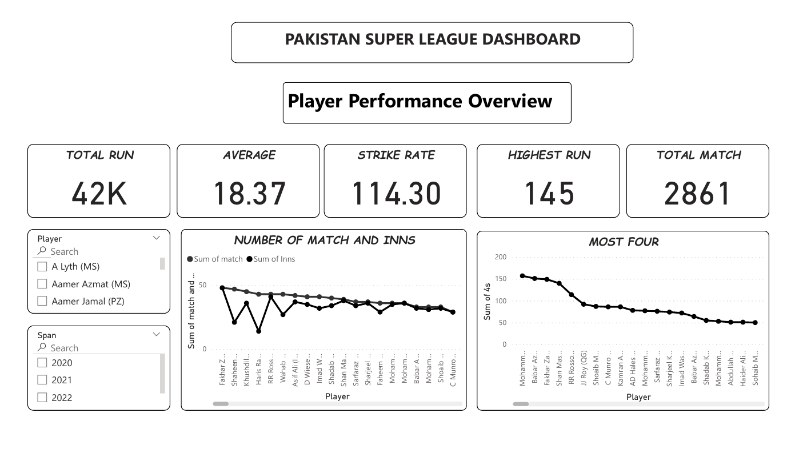
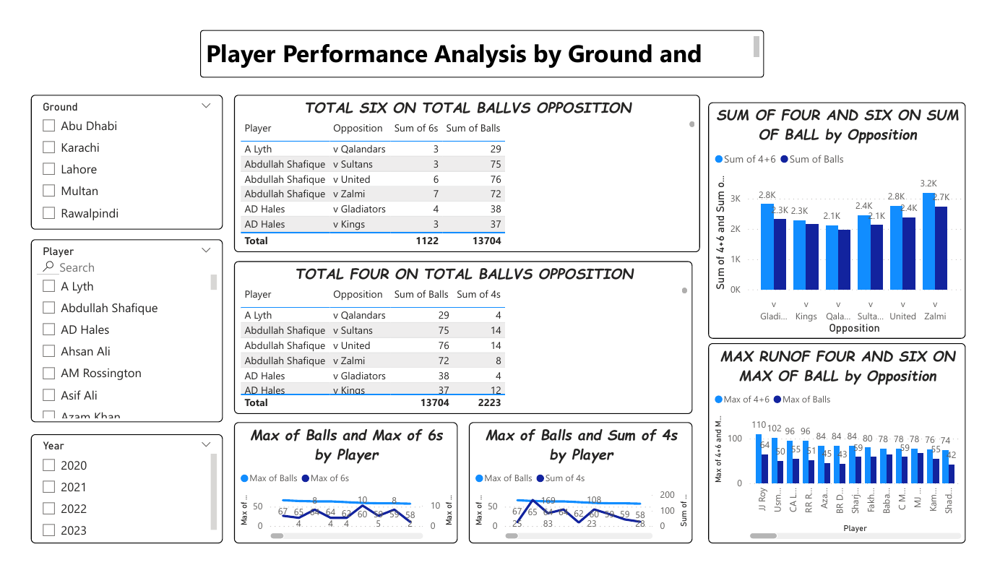
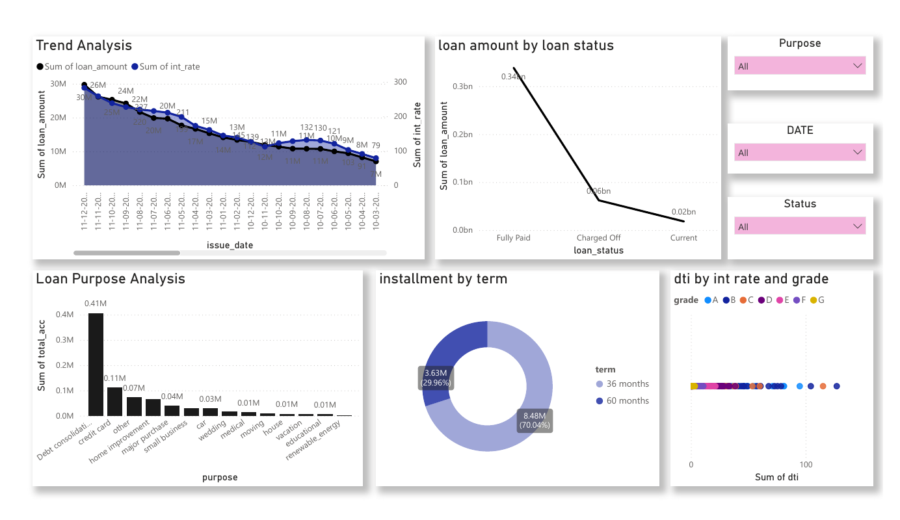

<p align="center">
  
</p>

<p align="center">
  
  
  
</p>

# Power BI Dashboards

**Three interactive Power BI reports: Pakistan Super League batting analysis, a bank loan portfolio dashboard, and a customer collection and sales-target analysis.**

Each report is a `.pbix` file with the data embedded, so it opens ready to explore with Power BI Desktop. Two of them also include a PDF export of the report pages.

---

## Dashboards at a glance

| Dashboard | Domain | Pages | Folder |
|---|---|---|---|
| [PSL cricket](#1-pakistan-super-league-cricket-dashboard) | Sports analytics | 5 | `psl-cricket-dashboard/` |
| [Bank loan analysis](#2-bank-loan-analysis) | Finance | 2 | `bank-loan-analysis/` |
| [Collection analysis](#3-collection-and-customer-trends) | Sales and receivables | 2 | `collection-analysis/` |

---

## 1. Pakistan Super League cricket dashboard

Batting performance of players in the Pakistan Super League: overall numbers, and drill-downs by ground, opposition, season and player.

| Page | What it shows |
|---|---|
| Player Performance Overview | KPI cards (total runs, average, strike rate, highest run, total matches), matches and innings per player, most fours. Slicers for player and season span. |
| Performance by ground and opposition | Sixes and fours against balls faced per opposition team, and 4s + 6s per opposition. Slicers for ground, player and year. |
| Highest strike-rate innings | Maximum runs, total runs and maximum strike rate against each opposition. |
| Milestones | Most 50s, 100s and ducks (zeros) by player. |
| Boundaries in an innings | Maximum sixes and fours in an innings by player. |




Files: `psl-cricket-dashboard/psl-cricket-dashboard.pbix` and `psl-cricket-dashboard.pdf`.

---

## 2. Bank loan analysis

A loan portfolio dashboard with a summary page and an analysis page.

| Page | What it shows |
|---|---|
| Summary | KPI cards (total loans, total funded amount, total received amount, average interest rate, average annual income), a loan status table (charged off, current, fully paid), a map of loans by state, and slicers for grade, purpose, state and employment length. |
| Analysis | Trend of loan amount and interest rate by issue date, loan amount by loan status, loan purpose analysis, installment split by term (36 and 60 months), and debt-to-income against interest rate by grade. Slicers for purpose, date and status. |



Files: `bank-loan-analysis/bank-loan-analysis.pbix` and `bank-loan-analysis.pdf`.

---

## 3. Collection and customer trends

A two-page report on customer shopping behavior and invoice collection.

| Page | What it shows |
|---|---|
| Customer Trends | Average age, quantity, target and target-achievement cards; a table and a line chart; slicers for gender, category and a calendar (year, quarter, month, day of week). |
| Collection | Total collection, count of invoices and weighted average collection days; monthly collection growth; payment days against actual days by month; slicers for gender, category, city and calendar. |

The report draws on a customer shopping table, a collection (invoice) table, a master table with customer city, and a calendar table. The report uses measures such as *Total Payment* and *Weighted Average Collection Days*, and the file includes a saved DAX query.

Files: `collection-analysis/collection-analysis.pbix` (no PDF export or preview yet).

---

## Skills shown

- Interactive report design with KPI cards, slicers, tables, line, column, donut and scatter charts, and a map visual.
- Multi-page reports with consistent filtering by player, ground, year, grade, purpose, category and calendar periods.
- A multi-table data model with a calendar table for time-based analysis (collection report).
- DAX measures for totals and weighted averages.

## How to open

The `.pbix` files require [Power BI Desktop](https://powerbi.microsoft.com/desktop/) (Windows). Open a file, use the slicers to filter, and switch pages with the tabs at the bottom. The PDFs show the report pages without Power BI.

## Repository structure

```
powerbi-project/
├── psl-cricket-dashboard/     # .pbix and PDF export
├── bank-loan-analysis/        # .pbix and PDF export
├── collection-analysis/       # .pbix
├── images/                    # dashboard previews used in this README
└── docs/banner.svg
```

## Notes

- The data is embedded in each `.pbix` file. The original source files are not included in this repository.
- The files were renamed from `PAKISTAN(PSL)`, `financial` and `collection` to the folder names above.

## Future improvements

- Add a PDF export and preview image for the collection report.
- Document the data source and a short data dictionary for each report.
- Add a page-level insights summary (for example, top findings) to each dashboard.
